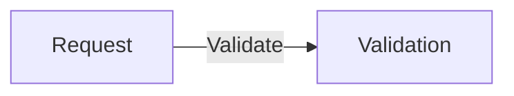
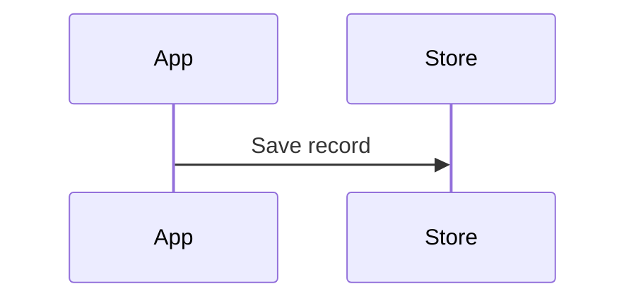

# tkstack


tkstack is a set of personal skills as well as a web-viewer for Markdown files. It has a unique form of showing diffs using a mixture of callstack diffs and mermaid diagram links, which I've found to be personally extremely helpful in understanding massive diffs.

```sh
npx tkstack path/to/file.md
```

## Agent skill

Install the code walkthrough skill from this repository:

```sh
npx skills add tanishqkancharla/tkstack --skill code-walkthrough
```

Options:

- `--port <n>` — listen port (default `4177`)
- `--root <dir>` — workspace root for file excerpts (default the directory you ran the command from)

**Done** in the top right stops the server.

The server also stops after 24 hours without a page or source request.
Loading or refreshing the page resets the timer; background health checks and
Vite connections do not keep it alive.

List every running viewer, including viewers using custom ports:

```sh
npx tkstack list
```

Request the page with `Accept: text/markdown` to read the current source file
instead of the rendered HTML:

```sh
curl -H 'Accept: text/markdown' http://127.0.0.1:4177/
```

## Library

```ts
import { startServer, parseFence, parseViewerDocument } from "tkstack";
```

`parseViewerDocument` turns markdown into the page document with [md4x](https://github.com/unjs/md4x). `startServer` listens. Halo skills own spec vs walkthrough section order; tkstack does not.

## Fences

| Fence info string                              | Viewer                                                                                            |
| ---------------------------------------------- | ------------------------------------------------------------------------------------------------- |
| `mermaid`                                      | Beautiful Mermaid                                                                                 |
| `callstack` or `diff` containing `└──` / `├──` | Interactive stack rows, no file header                                                            |
| `diff` or `diff:path` with a file path         | Pierre patch with Pierre’s file header                                                            |
| `diff` with no path                            | Pierre patch, no file header                                                                      |
| `start:end:path`                               | Pierre file excerpt with Pierre’s file header                                                     |
| `html`                                         | Trusted HTML from this file. tkstack does not sanitize it. Only use it for local files you wrote. |
| other langs                                    | Maui `CodeBlock`                                                                                  |

Fences keep whitespace. Use them for mermaid, call stacks, and diffs.

## MDC

md4x Comark components map to the same views:

```md
::mermaid
flowchart TD
A --> B
::

::callstack
startServer
+└── createViteServer
::

::diff{path="src/cli.ts"}
--- a/src/cli.ts
+++ b/src/cli.ts
::

::file{path="src/cli.ts" start="1" end="20"}
::

::html
<aside>Note.</aside>
::
```

`.md` and `.mdx` are both markdown. Curly braces in prose are plain text.

## Link call stacks to source changes

Append `[[path/to/file.ts#symbolName]]` to a call stack line to link a symbol.
Paths are relative to `--root`. Symbol lookup supports Python, TypeScript and JavaScript
declarations, including qualified names such as `[[src/store.ts#Store.save]]`.
Ambiguous names show the qualified names you can use instead.

```callstack
 handleRequest [[src/request.ts#handleRequest]]
+└── validateInput # reject invalid input [[src/validation.ts#validateInput]]
```

The panel highlights the declaration in the current workspace file. If an
included source patch overlaps that declaration and its new-side text matches
the workspace, the panel highlights the patch instead. Symbol references do not
require a `source-diff` fence. Use `[[path/to/file]]` for a whole file or
`[[path/to/file#L12-L30]]` for a file range; these work with other languages too.

To reference an exact change, including removed code, use the patch syntax below.
Symbol names resolve against current files; use an `old` reference for a deleted
symbol or a historical version.

Append `[[id:side:start-end]]` to a call stack line. `side` is `old` or `new`;
line numbers refer to that version of the source file, not the patch. A single
line can use `[[id:new:12]]`. Multiple references on one stack line are allowed.
The references are hidden in the rendered stack, and linked rows support mouse
clicks and keyboard activation.

Define each ID once in a `source-diff:id:path` fence anywhere in the document.
Copy the file's actual Git patch, including its `diff --git`, file headers, and
`@@` hunk headers. Keep enough context to explain the change. Each reference
range must fit within one included hunk. Use the new path for renamed files and
the old path for deleted files.

````md
```callstack
 handleRequest
-└── saveUnchecked [[request:old:12]]
+├── validateInput # reject invalid input [[request:new:12-13]]
 └── saveRecord
```

```source-diff:request:src/request.ts
diff --git a/src/request.ts b/src/request.ts
--- a/src/request.ts
+++ b/src/request.ts
@@ -10,5 +10,6 @@
 export function handleRequest(input: Input) {
   const record = input.record;
-  saveUnchecked(record);
+  const error = validateInput(record);
+  if (error instanceof Error) return error;
   return saveRecord(record);
 }
```
````

References open in one shared panel beside the walkthrough. Selecting a stack
line or diagram element highlights it and scrolls the panel to the linked code
range. When a target has several references, buttons above the source viewer
select among them. On narrow windows the source panel sits below the walkthrough.
Documents without references or source patches keep the single-panel layout.

Unknown IDs, duplicate definitions, malformed references, mismatched paths, and
ranges outside the included hunks produce a parse error. Source patches are
embedded snapshots; the viewer does not regenerate them from the working tree.

Cmd-click (or Ctrl-click) a Python, TypeScript or JavaScript symbol in the source panel
to open its definition. Use Back to retrace navigation and return to the reference.
Resolution uses the workspace's TypeScript configuration and current files.
Deleted files and lines that no longer match the workspace show a message;
their call stack references still highlight the embedded old-side diff.

Run `npx tkstack fixtures/annotations.md` for an example
with old/new references, multiple files, and unchanged context.

## Link Mermaid nodes and edges

Inside a Mermaid fence, add `%% ref node:<id> [[reference]]` to link a node or
participant, or `%% ref edge:<index> [[reference]]` to link an edge or sequence
message. Edge indices start at zero in declaration order. The same file, symbol,
and old/new patch references work here. Keep one directive per target; append
multiple references to that directive when needed.

````md



````

Click a linked shape, edge line, or edge label, or focus it with Tab and press
Enter or Space. Directives are Mermaid comments, so they remain hidden and do
not change the diagram when rendered by other Mermaid tools. Missing diagram
targets display an error. See [the runnable example](fixtures/references.md).

## Explore explanations before code

Diagram nodes, arrows, and call-stack rows can link to `[[explain:detail-id]]`.
Define each detail in an `explain:detail-id` JSON fence with a `title`, `summary`,
and optional `steps`, `inputs`, `outputs`, `why`, `example`, `caveat`, `diagram`,
`sources`, and `related` fields. Sources use the usual reference syntax without
brackets; related entries are other detail IDs. The first detail opens by default.

The right panel offers Explanation, Diagram, and Code tabs. Detail diagrams can
link to further details, Back returns to the previous selection, and diagram zoom
controls keep dense views readable. Try the runnable example with `node bin.js fixtures/exploration.md --root .`
from this checkout. See [the explanation format](skills/code-walkthrough/references/explanations.md)
and [the walkthrough skill](skills/code-walkthrough/SKILL.md) for authoring guidance.

Python navigation uses the bundled Pyright language server. It follows resolvable
imports and methods within the selected workspace without executing project code.
Click a token to reveal an explicit Open definition action, or use Cmd/Ctrl-click.
Dynamic calls and missing dependencies can remain unresolved. Existing TS/JS
navigation continues to use TypeScript. Stale diff lines cannot be resolved against
current workspace code.
