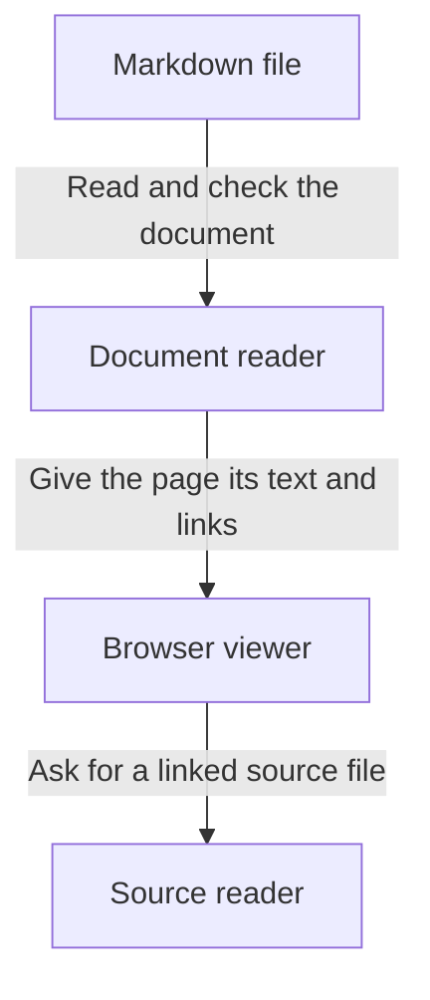

# How tkstack turns Markdown into an explorable page

You give tkstack a Markdown file and a source directory. It reads the document, checks its links, and displays a local page. Click a box or arrow below to understand a step; the Code tab shows its implementation.

This walkthrough describes the current implementation, not a change from a previous version. The examples below illustrate how document errors are handled.



The detail panel keeps the purpose, decisions, and supporting code together. Source links refer to files under the directory passed with `--root`.

```explain:overview
{
  "title": "From a document to an explorable page",
  "summary": "tkstack serves a Markdown document as a local page with diagrams and links into source code.",
  "inputs": "A Markdown file and the source directory it describes.",
  "outputs": "A browser page where readers can move from an overview to details and source.",
  "steps": [
    "Read and validate the document.",
    "Render the text, diagrams, and linked explanations.",
    "Resolve source references when the reader opens code."
  ],
  "sources": [
    "src/serve.ts#startServer"
  ],
  "related": [
    "parse",
    "explore",
    "source"
  ]
}
```

```explain:parse
{
  "title": "Read the document and check its links",
  "summary": "The document reader recognizes text, diagrams, code patches, and explanation blocks. It connects references before sending the result to the page.",
  "why": "A broken link should produce an actionable error instead of silently opening unrelated code.",
  "inputs": "The Markdown text.",
  "outputs": "A structured document, or an error describing a broken reference.",
  "steps": [
    "Read the Markdown structure.",
    "Collect explanation blocks and code patches.",
    "Check that detail IDs and patch references exist."
  ],
  "example": "Illustration: an arrow referring to explain:missing without that detail produces a document error.",
  "caveat": "Diagram target IDs are checked when each diagram renders; source symbols are resolved when opened.",
  "diagram": "flowchart TD\nText[Markdown text] --> Collect[Collect details and patches]\nCollect --> Check[Check references]\nCheck -->|Valid| Page[Ready to display]\nCheck -->|Invalid| Error[Return a document error]\n%% ref node:Collect Read a detail block [[explain:detail]]\n%% ref edge:0 Recognize explanation fields [[explain:detail]]",
  "sources": [
    "src/parseViewer.ts#parseViewerDocument"
  ],
  "related": [
    "detail",
    "explore"
  ]
}
```

```explain:detail
{
  "title": "Read one explanation block",
  "summary": "An explanation block stores the purpose of a step, its inputs and outputs, and optional deeper diagrams and code references.",
  "inputs": "JSON inside an explain:id fence.",
  "outputs": "A checked explanation with parsed source and diagram references.",
  "steps": [
    "Require a nonempty title and summary.",
    "Check the types of optional fields.",
    "Read source references and nested diagram annotations."
  ],
  "example": "Illustration: a number in the summary field is rejected because the viewer expects text.",
  "sources": [
    "src/explanations.ts#parseExplanation"
  ],
  "related": [
    "parse"
  ]
}
```

```explain:explore
{
  "title": "Move between explanations, diagrams, and code",
  "summary": "Selecting a linked node or arrow opens its explanation. The tabs show a deeper diagram or its source, and Back returns to the previous selection.",
  "steps": [
    "Select a linked node, arrow, or stack row.",
    "Read the explanation and follow a deeper step if needed.",
    "Open Code to inspect the evidence."
  ],
  "sources": [
    "src/viewer/ExplorationPanel.tsx#ExplorationPanel",
    "src/viewer/ViewerApp.tsx#ViewerApp"
  ],
  "related": [
    "source"
  ]
}
```

```explain:source
{
  "title": "Open the code that supports a step",
  "summary": "The source reader resolves a file, line range, or named declaration under the selected source directory.",
  "inputs": "A reference such as src/parseViewer.ts#parseViewerDocument.",
  "outputs": "The file contents and the line range to highlight, or a navigation error.",
  "caveat": "Current-file references describe current source. Use an embedded old-side patch to explain deleted code.",
  "sources": [
    "src/definitions.ts#readSourceReference"
  ],
  "related": [
    "explore"
  ]
}
```
