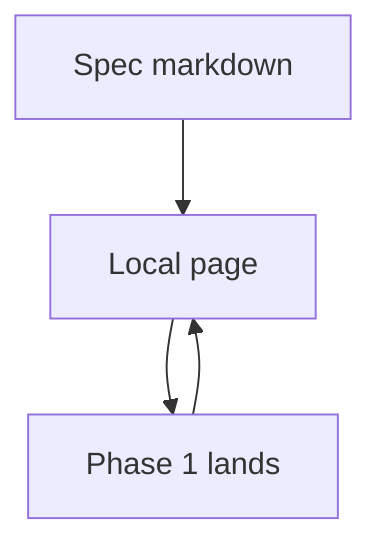

# Spec then implement

A fixture for a living spec: one phase landed, one still planned.

## System flow



## Problem overview

Readers need one page that shows what already shipped and what is still proposed.

## Solution overview

Keep both phases in the same file. The landed phase has a real `source-diff`. The planned phase is a call stack with open checkboxes.

## Goals

- TOC nests both phases.
- Diff panel only has the landed patch.

## Non-goals

- Generating the patch from git in the viewer.

## Implementation

### Phase 1: Validate before saving

```callstack
 handleRequest
-├── saveUnchecked  # accepted invalid input [[request:old:12]]
+├── validateInput  # reject empty names [[request:new:12-13]]
 └── saveRecord  # store validated input [[request:new:14]]
```

Validation now runs before persistence.

```source-diff:request:src/request.ts
diff --git a/src/request.ts b/src/request.ts
--- a/src/request.ts
+++ b/src/request.ts
@@ -10,5 +10,6 @@
 export function handleRequest(input: Input) {
   const record = input.record;
-  saveUnchecked(record);
+  const error = validateInput(record);
+  if (error instanceof Error) return error;
   return saveRecord(record);
 }
```

- [x] Validate in the handler.
- [x] Skip the write when validation fails.

### Phase 2: Tell the user why

```callstack
 handleRequest
 └── validateInput
+    └── formatError  # turn the tagged error into copy the UI can show
 └── saveRecord
```

- [ ] Return a message the UI can show.
- [ ] Keep Phase 1’s write path unchanged.
