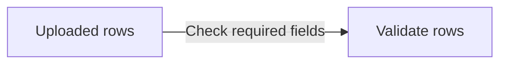

# Linked explanation format

Use these optional details when a reader needs more than a diagram label but should not have to start by reading code. Existing source-only annotations continue to work.

````md


```explain:validation
{
  "title": "Check the uploaded rows",
  "summary": "Check that each row contains the fields needed to create a record before saving anything.",
  "why": "Report incomplete rows while the user can still correct the upload.",
  "inputs": "The rows read from the uploaded file.",
  "outputs": "Valid rows or a list of row numbers and missing fields.",
  "steps": ["Read each row.", "Check the required fields.", "Return any errors before saving."],
  "example": "Illustration: if row 3 is missing a name, return an error for row 3 and save nothing.",
  "caveat": "This checks required fields; duplicate records are checked separately.",
  "diagram": "flowchart TD\nRows[Uploaded rows] --> Check[Check required fields]\nCheck -->|All present| Ready[Ready to save]\nCheck -->|Missing fields| Errors[Return row errors]",
  "sources": ["src/importer.py#validate_rows"],
  "related": []
}
```
````

This example is illustrative: replace its behavior and source names with verified behavior and real files in the project being explained.

- `title` and `summary` are required nonempty strings.
- `why`, `inputs`, `outputs`, `example`, `caveat`, and `diagram` are optional strings. Text fields are plain text; `diagram` is Mermaid source with JSON-escaped newlines.
- `steps`, `sources`, and `related` are optional arrays of strings.
- `sources` uses existing reference syntax without brackets: `src/importer.py#validate_rows`, `src/store.ts#Store.save`, `src/importer.py#L12-L30`, or `patch-id:new:12-20`. A patch reference requires its matching `source-diff` fence.
- `related` contains other explanation IDs. IDs use letters, numbers, underscores, and hyphens; every referenced ID must exist exactly once.

The first explanation definition opens by default. Choose an orientation detail first. A node, arrow, or callstack row can combine `[[explain:id]]` with explicit source references. If none are supplied on that annotation, the viewer uses the detail’s sources. Explanation-only links are valid.

A detail’s `diagram` can contain the same `%% ref node:ID ... [[explain:id]]` and `%% ref edge:0 ... [[explain:id]]` directives as the main diagrams. Edge indices follow declaration order, including sequence self-messages. Link meaningful inner steps to deeper details; avoid a duplicate overview that adds nothing. Back returns to the previous selection.

The viewer validates malformed fields, duplicate IDs, missing related/details, and patch ranges while loading. Missing Mermaid targets are reported when rendering that diagram, so exercise each nested diagram too.
