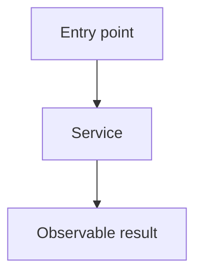
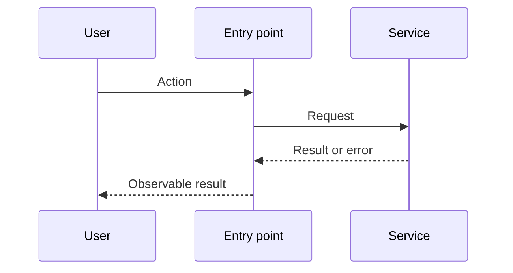

# Generate an implementation spec

This skill is the counter-equivalent of `$code-walkthrough`. That skill writes a walkthrough of work that already landed. This skill writes a spec for work that has not happened yet.

Research first, settle the design with the user, then write a spec an engineer can implement without repeating that work. Do not write the spec while critical questions remain open. Use annotated call stack diffs and Mermaid diagrams as the main explanation of current vs proposed paths. Link meaningful steps and diagram targets to source in the shared source panel.

## Workflow

### 1. Research

- Read the request, repository instructions, and relevant code.
- Trace the current runtime paths from entry points through state, side effects, errors, and user-visible results. Find the key types, callers, tests, and commands.
- Research external libraries, APIs, and prior art that affect the design. Prefer official docs and primary sources. Record useful links for the spec.
- Separate facts found in code or docs from design choices that still need the user's input.

### 2. Establish the design with the user

- Ask critical guiding questions before drafting. Focus on product behavior, scope, ownership boundaries, tradeoffs, failure behavior, migration, and rollout.
- Ask one focused question at a time. Give concrete options and explain the effect of each when useful.
- Use each answer to research further or ask the next question. Do not ask the user for facts the code or docs can answer.
- Continue until the goals, non-goals, behavior, and key technical choices are settled. State the agreed design briefly and resolve any correction before writing.

### 3. Write and serve the spec

Create `specs/<short-kebab-case-name>.md` with the format below. Do not write specs to a temporary directory.

After the markdown file exists, run it from the repo root:

```sh
npx tkstack specs/<name>.md
```

Options:

- `--port <n>` — listen port (default `4177`)
- `--root <dir>` — workspace root for file excerpts (default cwd)

The command prints a local URL and keeps running. **Done** in the top right posts `/__tkstack/shutdown` and stops the server.
The server also stops after 24 hours without a page or file-excerpt request. Loading or refreshing the page resets that timer.

Keep the server running and give the user the spec path and local URL. Do not open the URL in a browser unless the user explicitly asks.

## Spec format

````md
# <Feature or fix name>

## System flow

Put the main Mermaid flowcharts and sequence diagrams here, immediately after the title. Show current and proposed paths, boundaries, state changes, and important failure paths. Use multiple diagrams when they make the design easier to follow. Put the flow name in a Markdown heading immediately before each Mermaid fence, such as `### Create a conversation`. Link nodes and edges to source with `%% ref` directives.

### Request processing



### Send a request



## Problem overview

Explain the current problem and why it matters in a few plain sentences.

## Solution overview

Explain the agreed change and its key design choices in a few plain sentences.

## Goals

- State the results that must hold.

## Non-goals

- State what this spec leaves out.

## Important files, docs, and websites

- [`path/to/file.ts`](../path/to/file.ts) — Explain why it matters.
- [External source](https://example.com) — Explain the decision it supports.

List only sources that help implement the change.

## Implementation

### Phase 1: <Commit-sized outcome>

Explain the outcome and how this phase changes the runtime path.

```callstack
 requestHandler [[src/request.ts#requestHandler]]
-└── existingService [[src/service.ts#existingService]]
+└── validateInput [[src/validation.ts#validateInput]]
+    └── existingService [[src/service.ts#existingService]]
```

Walk through the call-stack change, then show short code previews of the main edits. Include paths and enough surrounding control flow to make the plan concrete; use `...` instead of writing a full patch.

```diff:path/to/handler.ts
 async function requestHandler(input: ImportantInput) {
-  return existingService(input);
+  const valid = validateInput(input);
+  return existingService(valid);
 }
```

- [ ] Make the concrete change, naming files and symbols.
- [ ] Wire it into its nearest caller or consumer.
- [ ] Add or update the high-value test when this phase reaches a public behavior boundary.
- [ ] Run `<exact focused check>`.
- [ ] Run `<repository check command>`.
````

Prefer `[[path/to/file.ts#symbolName]]` on a stack line when linking a current TypeScript or JavaScript declaration. Use qualified names such as `[[src/store.ts#Store.save]]` when names are ambiguous. TK Stack highlights a matching included new-side patch when possible, otherwise the current file. A symbol reference does not require an embedded patch. Use `[[path/to/file]]` or `[[path/to/file#L12-L30]]` for files and ranges in other languages. Leave proposed-only symbols unlinked until they exist, or link the file they will live in.

Append `[[id:old:start-end]]` or `[[id:new:start-end]]` to a stack line to link an exact source change. Use actual source line numbers from the compared versions; `[[id:new:12]]` links a single line. Keep references separate from the visible `#` explanation. Link removed steps with `old` references, including steps whose source file was deleted. Link unchanged steps when their implementation changed, and leave context-only steps unlinked. A line may reference several changes, including different files.

Define each referenced ID once in a `source-diff:id:path` fence anywhere in the Markdown. Copy the real file patch from the same Git comparison, including `diff --git`, `---`, `+++`, and `@@` headers. Include surrounding context; each reference range must fit within one included hunk. Use the new path for renames and the old path for deletions. Do not invent patches or renumber hunks. For untracked files, obtain a patch with `git diff --no-index -- /dev/null <path>` (exit 1 means differences). Specs should use `source-diff` only for real existing patches the design depends on. Use `diff:path` fences for proposed sketches of unwritten code; do not invent git patches for work that has not landed.

Mermaid diagrams can use the same references. Inside the fence, add `%% ref node:<id> [[path#symbol]]` for a node or sequence participant, or `%% ref edge:<index> [[id:new:start-end]]` for an edge or sequence message. Edge indices start at zero in declaration order. Put multiple references on one directive rather than repeating its target. These are Mermaid comments and do not appear in labels.

TK Stack hides reference markers and renders source definitions in one shared panel. Clicking a stack line, linked diagram node, or linked edge scrolls to and highlights its code. For full syntax, read the [TK Stack README](https://github.com/tanishqkancharla/tkstack#link-call-stacks-to-source-changes) and [example](https://github.com/tanishqkancharla/tkstack/blob/main/fixtures/annotations.md). Mermaid node and edge links are shown in the [diagram example](https://github.com/tanishqkancharla/tkstack/blob/main/fixtures/references.md).

Use `callstack` fences with tree branches (`└──` / `├──`) and unified diff signs. Call stacks render without a file header. Put a trailing `#` comment on a line when the symbol name does not explain its purpose, return value, condition, or side effect. A standalone `#` comment can explain the next step. Skip comments that merely repeat the symbol name.

## Phase rules

- Use as many phases as needed. Each phase should be one working commit and about 200 changed lines or fewer, including tests. Split it when it grows beyond that.
- Every phase must leave the repository working and produce visible or testable progress. Avoid setup-only phases unless later work cannot land safely without them.
- Give each phase four or five concrete checklist steps with exact files, symbols, and commands where known.
- Start every code phase with a unified-diff `callstack` fence, then explain it and show concise code diffs, types, or excerpts. Use more call stacks and sequence diagrams wherever they clarify control flow, async work, events, state, or errors.
- Call stacks must show the current path with removed lines and the proposed path with added lines. A UI render or event-handler path counts as a call stack.
- Link meaningful changed or current steps to source with `[[path#symbol]]` or patch references. Link Mermaid nodes and edges with `%% ref` directives. Do not strip these markers from the spec.
- Show the contracts that matter: inputs, outputs, state, events, and errors. Use `Not applicable — no code path changes` only for a true docs, data, or config phase.
- Test through a public package export or end-user surface when practical. For internal steps, use a focused smoke check rather than low-value tests or mocks.

## Fence reference

See the [TK Stack README](https://github.com/tanishqkancharla/tkstack) for rendering details. Specs use these fences:

| Fence info string                              | Viewer                                                       |
| ---------------------------------------------- | ------------------------------------------------------------ |
| `mermaid`                                      | Beautiful Mermaid ([Craft](https://agents.craft.do/mermaid)) |
| `callstack` or `diff` containing `└──` / `├──` | Interactive stack rows, no file header                       |
| `source-diff:id:path`                          | Named Git patch in the shared source panel                   |
| `diff:path`                                    | Proposed sketch patch with Pierre’s file header              |
| `start:end:path`                               | Pierre file excerpt with Pierre’s file header                |
| `html`                                         | Trusted HTML from this file. tkstack does not sanitize it.   |

Specs are markdown. Curly braces in prose are plain text. Use small tables for state ownership or data mappings when they clarify the call flows. Link to relevant source files in prose when useful; use call-stack and Mermaid references to show the current code the design depends on.

Use an `html` fence, or write HTML in the markdown, for callouts. HTML from this file is trusted local content. tkstack does not sanitize it. Only use it for files you wrote.

## Final check

Before serving, confirm that the spec reflects every user decision; diagrams and call stacks cover the important paths; call-stack lines and Mermaid targets that point at existing code include `[[path#symbol]]` or `%% ref` links; each phase stays near the 200-line limit and can land alone; previews name real files and symbols; links and commands are valid; `source-diff` fences are real patches rather than invented ones; and the full plan covers every goal without pulling in a non-goal. Confirm tkstack is serving the page.
