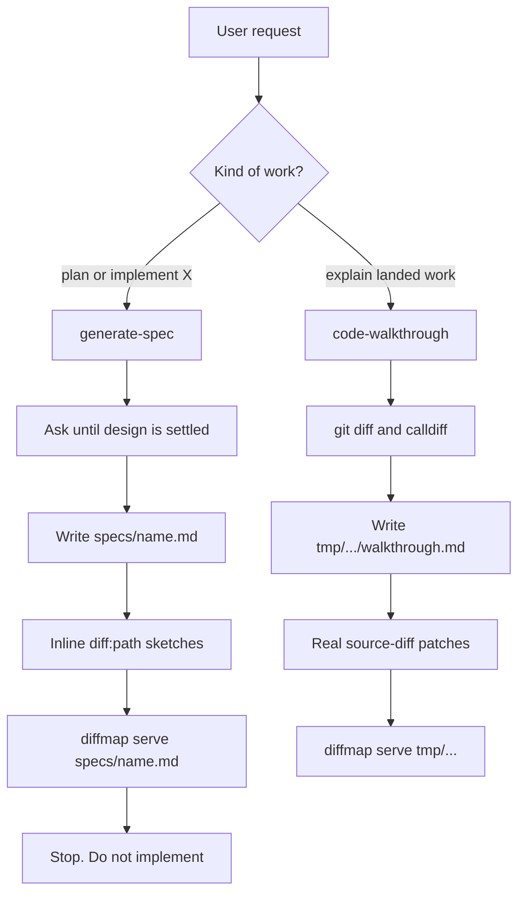
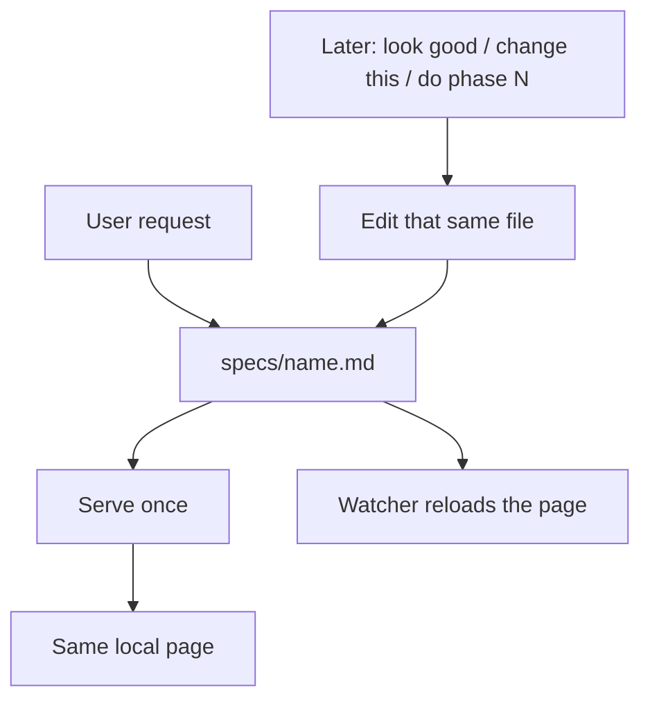
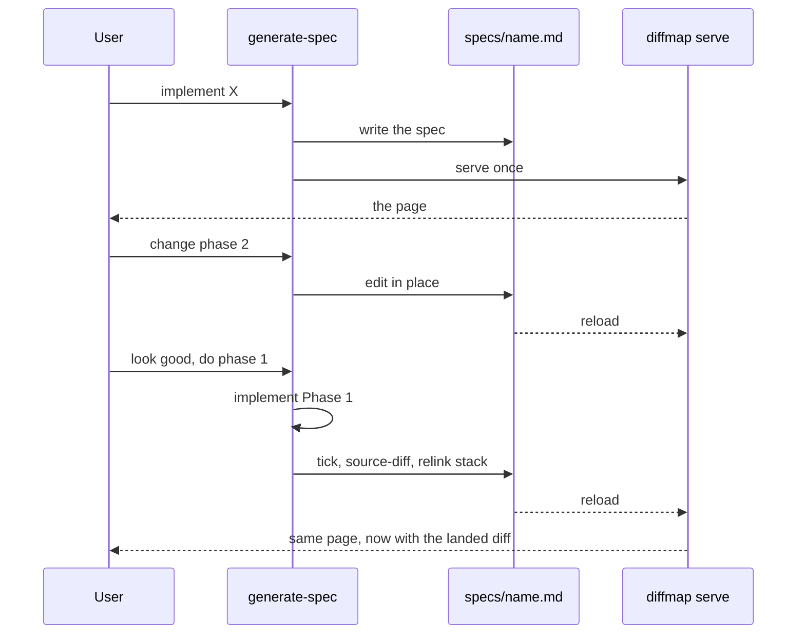

# Merge generate-spec and code-walkthrough

## System flow

**One document.** The agent writes `specs/<name>.md`, serves it once, and then **keeps that same file updated** whenever you ask to change the plan or to implement a phase. That is the whole product. There is no second page, second skill, or user-facing “mode switch.”

The viewer is already that page. `diffmap serve` reloads when the markdown changes. The first four phases of this spec are skill text only.

Product is **diffmap**: GitHub `tanishqkancharla/diffmap` (old `tkstack` URL 301s), npm `@tanishqkancharla/diffmap`, host `https://diffmap.dev`. Local CLI is `diffmap serve` (bare `npx @tanishqkancharla/diffmap <file>` is the same). `diffmap share` publishes a secret gist. GitHub-hosted specs pin to one SHA (`/owner/repo/pull/n/path` → `/commit/<sha>/path`). This spec does not re-implement those. Skill install name stays `generate-spec`. Do not `npm publish`.

### Current: two opposite skills, two files



Spec skill forbids implementing. Walkthrough skill forbids planning. There is no “look good, now do Phase 1” path. Diffs never appear on the spec page because the agent is banned from touching it after serve.

### Target: one file, keep editing it



You always read one URL. First load is a phased plan (proposed call stacks, open checkboxes, no patches). After you ask the agent to implement or revise, **that page** grows real `source-diff`s, ticks boxes, and rewrites stacks. Later phases stay proposed until you say go.

The only exception: “what did this PR do?” when **no spec exists yet**. Then the agent starts one file under `tmp/` and keeps **that** file updated the same way — still not a second skill. If a `specs/` file is already the record, never open `tmp/`.



The viewer does not read git. “Diffs show up automatically” means the agent edited the file and the page refreshed.

## Problem overview

`generate-spec` and `code-walkthrough` are written as opposites. One must not implement; the other must not plan. Specs go in `specs/` with invented `diff:path` sketches. Landed explanations go in a new `tmp/` file with real `source-diff` patches. Asking the agent to spec, then implement, cannot update the page you are already reading. Spec mode also interviews until the design is settled, so there is often no page until Q&A finishes.

## Solution overview

One skill (`generate-spec`), **one markdown file**, keep it updated. Delete the opposite-skill bans. First write: phases and proposed call stacks, serve, wait. Every later turn in the same chat (look good, change this, do phase N) edits **that file** — tick, real `source-diff`, relink stacks — and leaves the server running. Do not name the skill `diffmap` or `tkstack`. Keep `code-walkthrough` as the same skill under a second install name so existing installs still resolve.

Hosting already shipped on main: `diffmap share` → `https://diffmap.dev/g/<id>`; GitHub-hosted specs at `https://diffmap.dev/<owner>/<repo>/pull/<n>/<path>` pin to one commit SHA. The author loop stays local `serve`. Do not `npm publish`.

## Goals

- One install. One file at `specs/<name>.md` is the whole record for work that started as a spec.
- The agent keeps that file updated as you request changes or ask it to implement. No second document.
- First write: proposed call stacks only. No `source-diff`, no inline `diff:path` sketches.
- After a phase lands: tick, embed a real git patch, point that phase’s stack rows at it. Later phases stay proposed.
- “Explain this PR” with no spec yet: one file under `tmp/`, same keep-it-updated rule, no fake Implementation checklist.
- Serve once per file. If `npx @tanishqkancharla/diffmap list` already shows that file, reuse it.
- README: single `npx skills add tanishqkancharla/diffmap --skill generate-spec`.

## Non-goals

- A user-facing mode picker, or teaching spec vs implement vs walkthrough as three products.
- Renaming the skill to `diffmap` or `tkstack`. Install name stays `generate-spec`.
- Publishing npm (`@tanishqkancharla/diffmap` already exists in-repo; do not `npm publish` from this work).
- Re-implementing gist share or GitHub-hosted spec URLs (already on main).
- Viewer reading git itself, or generating patches from the working tree.
- Multi-file / directory viewer, or changing Maui TOC or Diff layout beyond auto-open, title refresh, and a parse error page.
- Deleting the `code-walkthrough` install name in this work (it becomes an alias of the merged skill).
- Implementing this merge before the user says look good.

## Important files, docs, and websites

- [`skills/generate-spec/SKILL.md`](../skills/generate-spec/SKILL.md) — Canonical skill. Today: research, Q&A until settled, `specs/<name>.md` with `diff:path` sketches, `npx @tanishqkancharla/diffmap specs/<name>.md`, do not implement.
- [`skills/code-walkthrough/SKILL.md`](../skills/code-walkthrough/SKILL.md) — Opposite skill. Today: landed-only research, `tmp/code-walkthrough-<name>/walkthrough.md`, real `source-diff`, do not plan.
- [`skills/generate-spec/agents/openai.yaml`](../skills/generate-spec/agents/openai.yaml) — Default prompt is “plan this feature as a phased implementation spec.”
- [`skills/code-walkthrough/agents/openai.yaml`](../skills/code-walkthrough/agents/openai.yaml) — Default prompt is explain already-made changes.
- [`README.md`](../README.md) — Two install lines; `serve` local, `share` gist; viewer does not own spec vs walkthrough section order.
- [`src/cli.ts`](../src/cli.ts) — `diffmap serve` (bare file arg is the same), `diffmap share`, `diffmap list`.
- [`src/serve.ts`](../src/serve.ts) — `startServer`: Vite, `strictPort`, 24h idle, `/__diffmap/meta` title captured at start.
- [`src/contentPlugin.ts`](../src/contentPlugin.ts) — Watches the markdown file and `reloadModule`s `virtual:diffmap`. `parseViewerDocument` errors throw and Vite fails the page.
- [`src/parseViewer.ts`](../src/parseViewer.ts) — Invalid `source-diff` is a parse error for the whole document.
- [`src/viewer/ViewerApp.tsx`](../src/viewer/ViewerApp.tsx) — Diff panel exists only when there are source diffs or references; starts closed.
- [`src/registry.ts`](../src/registry.ts) — Running-viewer list used to avoid a second server.
- [diffmap README — source links](https://github.com/tanishqkancharla/diffmap#link-call-stacks-to-source-changes) — `[[path#symbol]]` and `source-diff` syntax the skill must keep teaching.
- Hosted example of this spec: `https://diffmap.dev/tanishqkancharla/diffmap/pull/5/specs/merge-generate-spec-walkthrough.md` (PR number resolves to one head SHA, then pins).

## Implementation

### Phase 1: Merge the skill text

One `SKILL.md`. Description: write a spec, keep that same doc updated as the user revises or asks to implement, or explain landed work when there is no spec yet. Delete the “counter-equivalent / do not implement / do not plan” bans. Keep the install name `generate-spec`. Copy the same body into `skills/code-walkthrough` with `name: code-walkthrough`.

Do not teach three user-facing modes. The skill is: **find or create the one file, serve it once, edit it in place after that.**

```callstack
 agent
-├── generate-spec [[skills/generate-spec/SKILL.md]]
-│   ├── research then Q&A until settled
-│   ├── write specs/<name>.md  # includes diff:path sketches
-│   └── diffmap serve  # always start; then stop forever
-└── code-walkthrough [[skills/code-walkthrough/SKILL.md]]
-    ├── research landed change
-    ├── write tmp/code-walkthrough-<name>/walkthrough.md
-    └── diffmap serve  # a second document
+└── generate-spec [[skills/generate-spec/SKILL.md]]  # code-walkthrough is the same body
     ├── writeOrOpenOneFile  # specs/<name>.md, or tmp/ only if no spec and explain-landed
     ├── serveOnce [[src/cli.ts]]  # listRunningDiffmaps; skip if that file is already up
     │   └── listRunningDiffmaps [[src/registry.ts#listRunningDiffmaps]]
     └── on later turns: edit that same file  # revise plan, land a phase, add diffs
```

File rule: work that started as a spec is always `specs/<short-kebab-case-name>.md`. Never open a second file under `tmp/` for that work. `tmp/code-walkthrough-<name>/walkthrough.md` only when the user wants an explanation of existing work and no spec exists.

Serve once. Before `npx @tanishqkancharla/diffmap serve <file>`, run `npx @tanishqkancharla/diffmap list`. If that absolute file is already served, reuse its URL. Do not start a second server on 4177 (`strictPort` fails). Leave the process running. `share` is already a separate command; do not start a local server when sharing.

README: one install command. `openai.yaml` default prompt: “use diffmap to spec this, then keep the same doc updated as you implement phase by phase.”

- [ ] Rewrite [`skills/generate-spec/SKILL.md`](../skills/generate-spec/SKILL.md): one-file keep-updated loop; delete opposite-skill bans; serve-once via `npx @tanishqkancharla/diffmap list`.
- [ ] Mirror the same body in [`skills/code-walkthrough/SKILL.md`](../skills/code-walkthrough/SKILL.md) with `name: code-walkthrough`.
- [ ] Update [`skills/generate-spec/agents/openai.yaml`](../skills/generate-spec/agents/openai.yaml) default prompt to spec-then-keep-updating the same doc.
- [ ] Point [`skills/code-walkthrough/agents/openai.yaml`](../skills/code-walkthrough/agents/openai.yaml) at the merged skill.
- [ ] README: single `npx skills add tanishqkancharla/diffmap --skill generate-spec`. One paragraph: one file, keep it updated. Stop listing two opposite skills.
- [ ] Run `npm run format:check`. No product TypeScript in this phase.

### Phase 2: First write (then wait)

Replace “interview until settled, then write” with “research current paths, write the page, ask only if the answer would change the phases.” Section shape stays: System flow, Problem / Solution / Goals / Non-goals / Sources, Implementation / Phase N.

```callstack
 generate-spec [[skills/generate-spec/SKILL.md]]
-├── ask one question at a time until design is settled
-├── writeSpec
-│   ├── callstack  # proposed path
-│   └── diff:path  # inline sketches of unwritten code
-└── startServer [[src/serve.ts#startServer]]
+├── research current call paths
+├── ask only if the answer would change the phases
+├── writeOrEdit  # the one specs/<name>.md
+│   └── callstack  # proposed path only; proposed-only symbols unlinked
+└── serveOnce [[src/cli.ts]]
     └── startServer [[src/serve.ts#startServer]]  # skipped when list already has this file
```

First-write artifacts:

- Proposed `callstack` fences (current path with `-`, proposed path with `+`).
- Mermaid current vs new, with `%% ref` only to code that exists now.
- Phase checklists with files, symbols, and commands where known.

Forbidden until a phase has actually landed:

- `source-diff:id:path` (invented patches parse-error the whole page).
- Inline `diff:path` sketches (they stay in the article and do not fill the Diff panel; they are not the product).

After serving, tell the user the spec path and local URL. Stop and wait. Do not open the URL unless asked. Later turns are Phase 3, not a new file.

Drop `diff:path` from the skill’s format template as a first-write tool. Keep it in the README as a viewer fence; this document just must not use it.

- [ ] First-write section: research, write, serve, wait. Q&A only when it would change phases.
- [ ] Format template: phases + proposed call stacks. Remove the `diff:path` example and the “show short code previews” rule.
- [ ] Fence reference: first write uses `mermaid`, `callstack`, checklists. `source-diff` is after-land only.
- [ ] Final check: no `source-diff`, no `diff:path`, server up, path + URL reported.
- [ ] Run `npm run format:check`.

### Phase 3: Keep the same file updated

This is the product. Any later turn — “look good”, “change that diagram”, “do phase N” — edits **the same markdown**. After landing a phase, update the file in the same turn and leave `diffmap serve` running so HMR shows the patch.

```callstack
 generate-spec [[skills/generate-spec/SKILL.md]]
-└── stop after serving  # do not implement, do not edit again
+└── laterTurn  # look good / change this / do phase N
     ├── if implementing: one phase only
     ├── run that phase's focused check
     ├── gitDiff  # only the files this phase named
     ├── editSameFile
     │   ├── apply requested spec edits
     │   ├── tick checkboxes that are actually done
     │   ├── add source-diff:id:path  # real patch, only for files that landed
     │   └── relink callstack  # point landed rows at the new source-diff ids
     └── leaveRunning
         └── diffmapContentPlugin [[src/contentPlugin.ts#diffmapContentPlugin]]
             └── reloadModule  # page already open; do not start a second server
```

When a phase lands:

1. Tick only the checklist items that are actually done.
2. Paste a real `git diff` into `source-diff:id:path`. Include `diff --git`, `---`, `+++`, and `@@` headers. For untracked files, `git diff --no-index -- /dev/null <path>` (exit 1 means differences).
3. Update that phase’s call stack to the landed path. Link symbols with `[[path#symbol]]`. Point changed rows at the new diffs with `[[id:new:start-end]]` (and `old` for removals).
4. Leave later phases as still-proposed call stacks with no `source-diff`.
5. If a patch would be invalid (`parseViewerDocument` would throw), **omit** `source-diff` and say so in prose. Do not crash the page.
6. Do not write `tmp/code-walkthrough-*` for work that started as this spec.
7. After the last phase, this file **is** the walkthrough. Problem / Solution may shift to past tense.

Header title is captured at server start. Changing the H1 later will not refresh the chrome until Phase 5; do not rename the H1 mid-flight unless the user is told to restart.

- [ ] Keep-updated section: same file every turn; tick / `source-diff` / relink only for work that landed; later phases stay proposed.
- [ ] Invalid-patch rule: omit `source-diff`, explain in prose, keep the page alive.
- [ ] Keep-alive: `npx @tanishqkancharla/diffmap list` before serve; never a second server; never kill the running viewer.
- [ ] Ban opening `tmp/` for implement-from-spec work.
- [ ] Run `npm run format:check`.

### Phase 4: Explain-landed when there is no spec

Same keep-updated rule, different starting file. Copy today’s walkthrough research (`git diff`, calldiff, source-checked stacks). Start `tmp/code-walkthrough-<name>/walkthrough.md` only if there is no `specs/` file for this work. Same fences as a finished spec (`source-diff` + call stacks). No Implementation checklist. If they ask follow-ups, edit **that** file, do not start another.

```callstack
 agent
-└── code-walkthrough [[skills/code-walkthrough/SKILL.md]]
-    ├── collectChange
-    ├── write tmp/code-walkthrough-<name>/walkthrough.md
-    └── startServer [[src/serve.ts#startServer]]
+└── generate-spec [[skills/generate-spec/SKILL.md]]
     ├── if specs/<name>.md exists: edit that file  # not this path
     └── else write tmp/code-walkthrough-<name>/walkthrough.md
         ├── collectChange  # git diff, git log, PR range
         ├── calldiff
         ├── sourceCheck
         ├── callstack + source-diff  # real patches only
         └── serveOnce [[src/cli.ts]]
```

Keep: comparison range in the title area; past-tense Solution; outcome headings without `Chapter:`; no standalone source excerpts unless asked; verification claims match checks actually run.

- [ ] Explain-landed section: current research rules and `tmp/` only when no spec exists.
- [ ] Template: Problem / Solution / User flows / `## <outcome>` chapters. No Implementation checklist.
- [ ] If `specs/` already exists, update it. Follow-ups stay on the one file that was opened.
- [ ] Keep both skill folders in sync after this section lands.
- [ ] Run `npm run format:check`.

### Phase 5: Small viewer polish

Optional. Only this phase changes product TypeScript. Skill-only work already produces diffs via HMR; this phase makes that feel automatic and fail safe.

```callstack
 startServer [[src/serve.ts#startServer]]
 ├── extractTitle [[src/extractDocument.ts#extractTitle]]  # today: once at boot
 ├── diffmapContentPlugin [[src/contentPlugin.ts#diffmapContentPlugin]]
 │   ├── load
 │   │   └── parseViewerDocument [[src/parseViewer.ts#parseViewerDocument]]
-│   │       └── throw  # Vite overlay / blank page on bad source-diff
+│   │       └── on error: export parseError  # ViewerApp error page, not throw
 │   └── watcher.change → reloadModule
 └── handleDiffmapRequest [[src/serve.ts]]
     └── GET /__diffmap/meta
-        └── captured title
+        └── extractTitle  # re-read the markdown file
             └── ViewerApp [[src/viewer/ViewerApp.tsx#ViewerApp]]
-                └── showDiffPanel = false  # until Diff or a linked row
+                ├── title from meta after each reload
+                └── open Diff when sourceDiffs becomes non-empty after reload
```

Behavior:

- Re-read the H1 on `/__diffmap/meta` (and refetch from `ViewerApp` when `virtual:diffmap` reloads) so renaming the heading updates the chrome without restart.
- Auto-open the Diff panel when the first real `source-diff` appears after a reload. Symbol-only `[[path#symbol]]` references must not auto-open; first-write pages stay single-panel until a patch exists.
- If `parseViewerDocument` returns `DiffmapParseError` or `DiffmapAnnotationError`, `diffmapContentPlugin` must not throw. Show an error page with the message. The article watcher should still recover on the next valid save.
- **Not in this phase:** generating patches from the working tree.

- [ ] `/__diffmap/meta` re-reads the file through `extractTitle`. `ViewerApp` refreshes the header on HMR.
- [ ] Auto-open Diff iff `viewerDocument.sourceDiffs.length > 0` after reload; keep closed for references-only docs.
- [ ] `diffmapContentPlugin.load` exports a parse error instead of throwing; `ViewerApp` renders that error.
- [ ] Run `npm run typecheck` and `npm run lint`.
- [ ] Manual: serve a spec, add a valid `source-diff`, confirm Diff opens; break the patch, confirm an error page; fix it, confirm the page returns.

### Phase 6: Verify the one-file flow

No new product. Confirm the skill keeps one document updated.

```callstack
 verify
 ├── fixtureTwoPhases
 │   ├── Phase 1 landed  # source-diff + stack rows that reference it + checked boxes
 │   └── Phase 2 proposed  # call stack only, open boxes, no source-diff
 ├── ViewerApp [[src/viewer/ViewerApp.tsx#ViewerApp]]
 │   ├── TableOfContents [[src/viewer/TableOfContents.tsx#TableOfContents]]  # both phases nested
 │   └── SourceDiffPanel  # only the landed patch
 └── manualDogfood
     ├── npx skills add tanishqkancharla/diffmap --skill generate-spec
     ├── spec a tiny change
     ├── look good → implement phase 1
     └── same open viewer hot-reloads with the patch
```

Add a fixture (for example `fixtures/spec-then-implement.md`) with two Implementation phases in that mixed state. Confirm old skill names still resolve via the alias folder, and README no longer teaches two opposite skills.

- [ ] Add a two-phase fixture: one landed (`source-diff` + linked stack + checked boxes), one proposed (call stack only).
- [ ] Serve the fixture: TOC nests both phases; Diff panel lists only the landed patch; Phase 2 has no `source-diff`.
- [ ] Scratch-repo manual: install `generate-spec` only, spec a tiny change, approve, implement phase 1, confirm the **same** open viewer reloads and the patch appears. No second markdown file.
- [ ] Confirm `code-walkthrough` still installs; README install line is only `generate-spec`.
- [ ] Run `npm run typecheck` and `npm run lint` if Phase 5 landed; otherwise `npm run format:check`.
