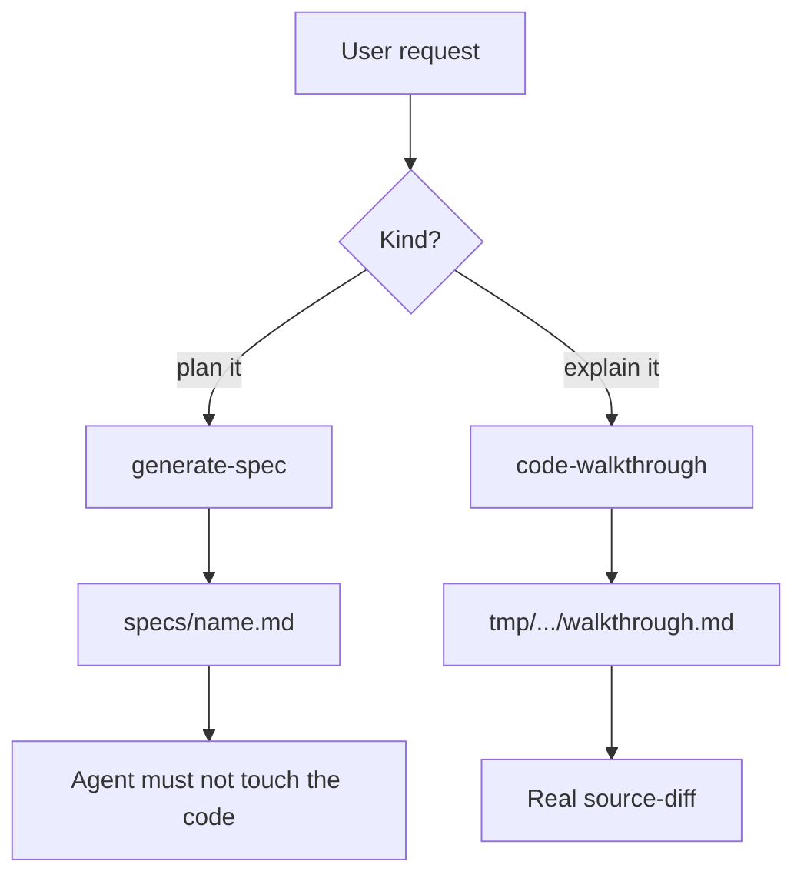
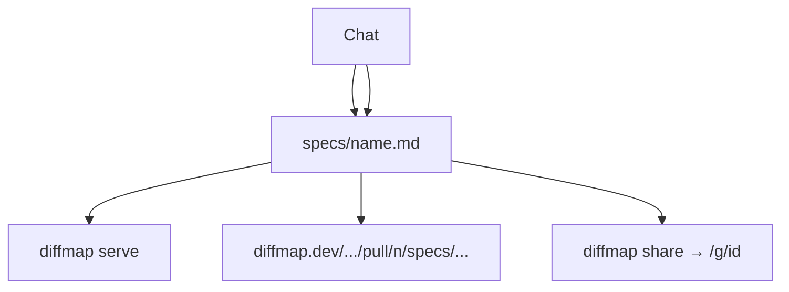
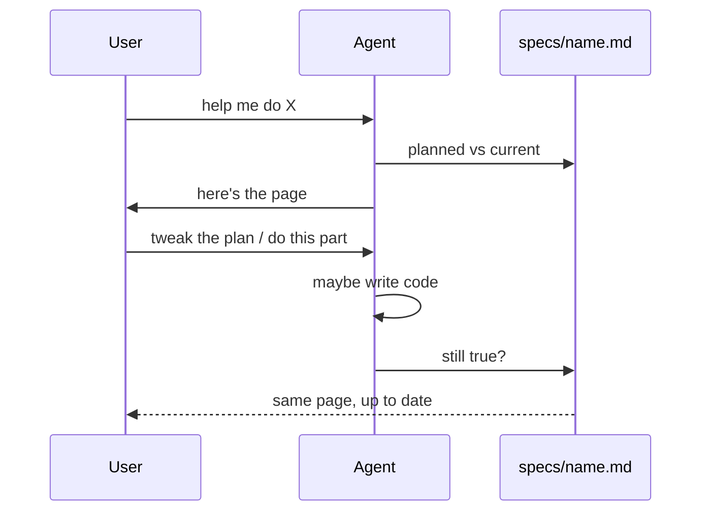

# Merge generate-spec and code-walkthrough

## System flow

The spec is a picture of the work: **what’s already in the tree, and what’s still planned.** It lives at `specs/<name>.md` for the life of that work. The agent keeps it honest as the plan changes and as code lands. Other people read it from a GitHub PR or a gist — hosting for that is already on main.

Not two skills. Not a walkthrough file you start later. Same doc.

Product is **diffmap** (`tanishqkancharla/diffmap`, npm `@tanishqkancharla/diffmap`, `https://diffmap.dev`). Skill install name stays `generate-spec`. Do not `npm publish`.

### Before



Two opposite skills, two files. The spec never learns what landed. The walkthrough never was the plan.

### What we want





Call stacks and mermaid are how you _see_ planned vs current. Real `source-diff` is only for code that actually landed (fake patches take down the whole page). Share is `diffmap share` or push the spec on a PR; `https://diffmap.dev/.../pull/n/path` pins to one SHA.

## Problem overview

The skills fought each other. One wrote a plan and then refused to update it. The other wrote a post-hoc walkthrough in a different folder. You couldn’t watch one page go from “here’s the idea” to “here’s what shipped.”

## Solution overview

Folded both into `generate-spec`. The skill is short: keep a spec that matches the work. Don’t interview forever before there’s a page. Don’t start a second markdown file for the same effort. `code-walkthrough` is the same body under a second install name. README: one `npx skills add tanishqkancharla/diffmap --skill generate-spec`.

Gist share and GitHub-hosted spec URLs already exist. The skill can mention them. Don’t rebuild hosting.

## Goals

- One spec file the reader can use to see done vs planned.
- It stays current while you plan and while you implement.
- It’s shareable: PR on GitHub (`diffmap.dev/<owner>/<repo>/pull/<n>/<path>`) or `diffmap share` (gist).
- First draft doesn’t invent git patches or inline `diff:path` sketches.
- One install line in the README.

## Non-goals

- A mode picker or a second “walkthrough” product.
- Publishing npm, renaming the skill, or rebuilding gist/PR hosting.
- Viewer reading git for you.

## Important files, docs, and websites

- [`skills/generate-spec/SKILL.md`](../skills/generate-spec/SKILL.md) — Living spec. Same file for plan and what landed.
- [`skills/code-walkthrough/SKILL.md`](../skills/code-walkthrough/SKILL.md) — Same body, `name: code-walkthrough`.
- [`README.md`](../README.md) — One install line; `serve` / `share` / list.
- [`src/cli.ts`](../src/cli.ts) — `diffmap serve`, `share`, `list`.
- [`src/contentPlugin.ts`](../src/contentPlugin.ts) — Parse errors export `parseError` instead of throwing.
- [`fixtures/spec-then-implement.md`](../fixtures/spec-then-implement.md) — Mixed planned/done fixture.
- [Hosted example of this spec](https://diffmap.dev/tanishqkancharla/diffmap/pull/5/specs/merge-generate-spec-walkthrough.md)

## Implementation

### Phase 1: One skill, one living spec

`generate-spec` is now a short living-spec skill. `code-walkthrough` is the same body with a different `name:`. README has one install line. The git patches for those markdown files contain nested fences, so they are not embedded here (they would blank the page). Open the files instead.

```callstack
 agent
-├── generate-spec  # plan, then freeze [[skills/generate-spec/SKILL.md]]
-└── code-walkthrough  # new tmp file [[skills/code-walkthrough/SKILL.md]]
+└── generate-spec [[skills/generate-spec/SKILL.md]]
     ├── write specs/<name>.md
     ├── diffmap serve [[src/cli.ts]]
     └── keep that file true [[prompt:new:4]]
```

```source-diff:prompt:skills/generate-spec/agents/openai.yaml
diff --git a/skills/generate-spec/agents/openai.yaml b/skills/generate-spec/agents/openai.yaml
index 5c14d70..04d9792 100644
--- a/skills/generate-spec/agents/openai.yaml
+++ b/skills/generate-spec/agents/openai.yaml
@@ -1,4 +1,4 @@
 interface:
   display_name: "Generate Spec"
-  short_description: "Write phased specs and serve them with diffmap"
-  default_prompt: "Use $generate-spec to plan this feature as a phased implementation spec."
+  short_description: "Keep a living spec of planned vs done and serve it with diffmap"
+  default_prompt: "Use $generate-spec to keep a spec up to date while you plan and implement."
```

- [x] Rewrite [`skills/generate-spec/SKILL.md`](../skills/generate-spec/SKILL.md) around the living spec. Drop counter-equivalent / do-not-implement / do-not-plan.
- [x] Same text in [`skills/code-walkthrough/SKILL.md`](../skills/code-walkthrough/SKILL.md) (`name: code-walkthrough`).
- [x] Update both `openai.yaml` prompts and the README install blurb.
- [x] `npm run format:check`

### Phase 2: Don’t lie in the markdown

The skill template is call stacks and mermaid for planned work, real `source-diff` only after land, `list` before serve, skip a bad patch. No `diff:path` sketches.

```callstack
 generate-spec [[skills/generate-spec/SKILL.md]]
-├── Q&A until settled
-├── spec with diff:path sketches
-└── stop
+├── spec with proposed call stacks
+└── later: same file, real source-diff for what landed
```

- [x] Template + fence notes: call stacks up front; `source-diff` only when the code exists; drop the `diff:path` example from the skill.
- [x] `npm run format:check`

### Phase 3: Viewer polish

Local viewer shows a parse error page instead of a Vite crash, re-reads the H1 on `/__diffmap/meta`, and opens Diff when a real `source-diff` is present.

```callstack
 diffmapContentPlugin [[src/contentPlugin.ts#diffmapContentPlugin]]
 └── parseViewerDocument [[src/parseViewer.ts#parseViewerDocument]] [[plugin:new:18]]
-    └── throw
+    └── export parseError [[plugin:new:19-21]] [[main:new:15-21]]
 ViewerApp [[src/viewer/ViewerApp.tsx#ViewerApp]]
-└── Diff stays closed
+└── open Diff when sourceDiffs show up [[viewer:new:35-37]]
 handleDiffmapRequest [[src/serve.ts]]
 └── GET /__diffmap/meta [[serve:new:261-264]] [[serve:new:269]]
```

```source-diff:plugin:src/contentPlugin.ts
diff --git a/src/contentPlugin.ts b/src/contentPlugin.ts
index 4e25bfd..88c2c4e 100644
--- a/src/contentPlugin.ts
+++ b/src/contentPlugin.ts
@@ -16,8 +16,10 @@ export function diffmapContentPlugin(input: {
       if (id !== virtualId) return;
       const source = await fs.readFile(input.filePath, "utf8");
       const document = parseViewerDocument(source);
-      if (document instanceof Error) throw document;
-      return `export const viewerDocument = ${JSON.stringify(document)};`;
+      if (document instanceof Error) {
+        return `export const viewerDocument = null; export const parseError = ${JSON.stringify(document.message)};`;
+      }
+      return `export const viewerDocument = ${JSON.stringify(document)}; export const parseError = null;`;
     },
     transformIndexHtml(html) {
       return html.replaceAll(
```

```source-diff:main:src/viewer/main.tsx
diff --git a/src/viewer/main.tsx b/src/viewer/main.tsx
index 30ba497..e155681 100644
--- a/src/viewer/main.tsx
+++ b/src/viewer/main.tsx
@@ -1,6 +1,7 @@
 import { StrictMode } from "react";
 import { createRoot } from "react-dom/client";
-import { MauiProvider } from "maui";
-import { viewerDocument } from "virtual:diffmap";
+import { MauiProvider, P } from "maui";
+import { parseError, viewerDocument } from "virtual:diffmap";
 import { ViewerApp } from "./ViewerApp.tsx";
+import { GistStatus } from "../gist/GistStatus.tsx";
 import "./styles.css";
@@ -11,7 +12,13 @@ if (root === null) throw new Error("diffmap root element is missing");
 createRoot(root).render(
   <StrictMode>
     <MauiProvider>
-      <ViewerApp document={viewerDocument} mode="local" />
+      {parseError !== null || viewerDocument === null ? (
+        <GistStatus title="Could not parse this spec">
+          <P>{parseError ?? "Unknown parse error."}</P>
+        </GistStatus>
+      ) : (
+        <ViewerApp document={viewerDocument} mode="local" />
+      )}
     </MauiProvider>
   </StrictMode>,
 );
```

```source-diff:viewer:src/viewer/ViewerApp.tsx
diff --git a/src/viewer/ViewerApp.tsx b/src/viewer/ViewerApp.tsx
index 4fd0b56..6f79b68 100644
--- a/src/viewer/ViewerApp.tsx
+++ b/src/viewer/ViewerApp.tsx
@@ -32,7 +32,9 @@ export function ViewerApp(props: {
   const viewerDocument = props.document;
   const meta = useViewerMeta(props.mode === "local");
   const [selection, setSelection] = useState<SourceSelection>();
-  const [showDiffPanel, setShowDiffPanel] = useState(false);
+  const [showDiffPanel, setShowDiffPanel] = useState(
+    viewerDocument.sourceDiffs.length > 0,
+  );
   const hasSourceDiffs =
     viewerDocument.sourceDiffs.length > 0 || viewerDocument.hasReferences;
   const diffPanelOpen = hasSourceDiffs && showDiffPanel;
```

```source-diff:serve:src/serve.ts
diff --git a/src/serve.ts b/src/serve.ts
index 4c251e1..11c7409 100644
--- a/src/serve.ts
+++ b/src/serve.ts
@@ -258,11 +258,15 @@ async function handleDiffmapRequest(input: {
     return;
   }
   if (parsed.pathname === "/__diffmap/meta" && input.method === "GET") {
+    const source = await fs
+      .readFile(input.filePath, "utf8")
+      .catch(() => undefined);
+    const title = source === undefined ? input.title : extractTitle(source);
     input.res.statusCode = 200;
     input.res.setHeader("content-type", "application/json; charset=utf-8");
     input.res.end(
       JSON.stringify({
-        title: input.title,
+        title,
         file: input.filePath,
         pid: process.pid,
       }),
```

- [x] Parse error page; re-read title from `/__diffmap/meta`; auto-open Diff when `sourceDiffs` is non-empty.
- [x] `npm run typecheck` and `npm run lint`

### Phase 4: Check it

Mixed fixture is [`fixtures/spec-then-implement.md`](../fixtures/spec-then-implement.md) (nested fences, so no `source-diff` of that file here). `npm test`, `typecheck`, and `lint` passed. README no longer sells two opposite skills.

- [x] Mixed planned/done fixture.
- [x] Checks: `npm run format`, `lint`, `typecheck`, `test`.
- [x] `npm run format:check` (and typecheck/lint if Phase 3 landed)
