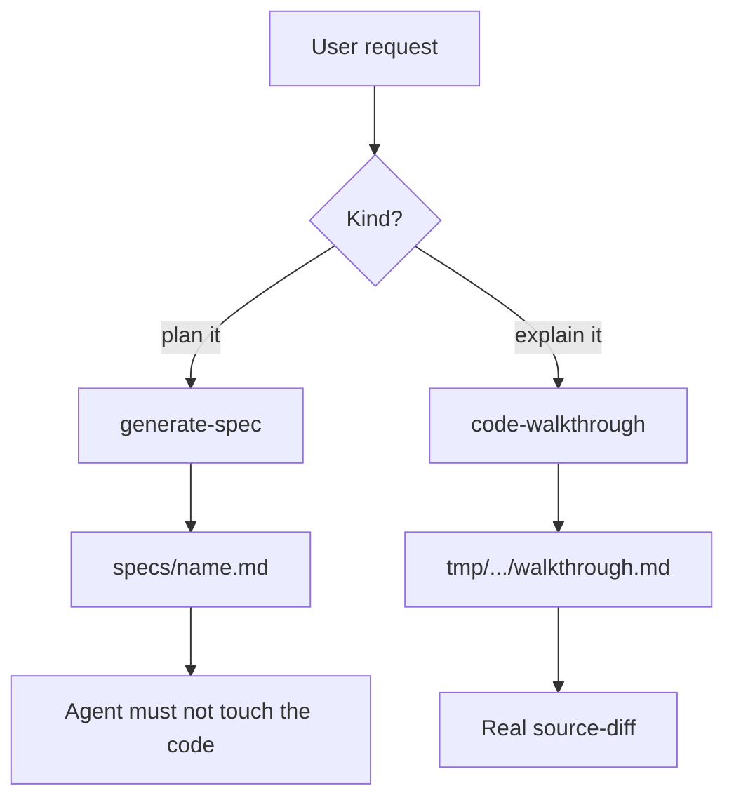
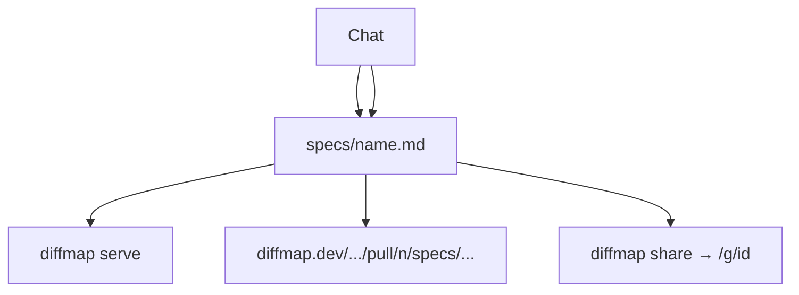
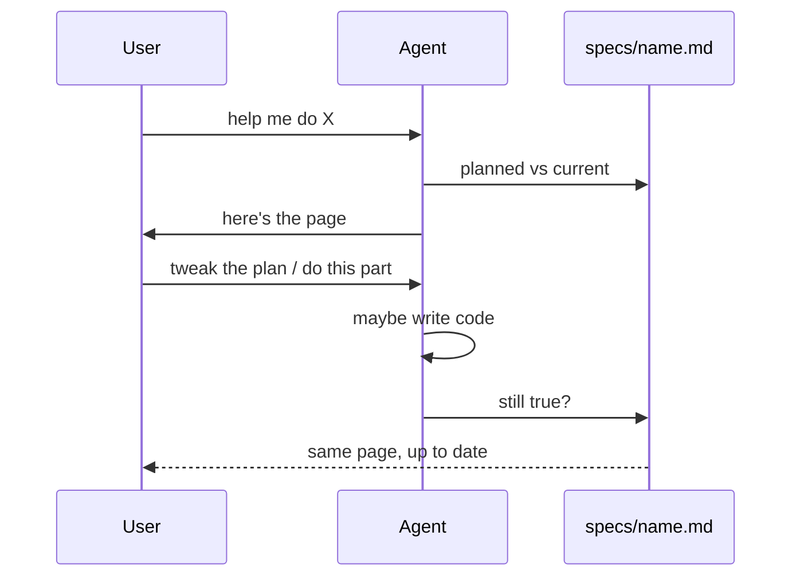

# Merge generate-spec and code-walkthrough

## System flow

The spec is a picture of the work: **what’s already in the tree, and what’s still planned.** It lives at `specs/<name>.md` for the life of that work. The agent keeps it honest as the plan changes and as code lands. Other people read it from a GitHub PR or a gist — hosting for that is already on main.

Not two skills. Not a walkthrough file you start later. Same doc.

Product is **diffmap** (`tanishqkancharla/diffmap`, npm `@tanishqkancharla/diffmap`, `https://diffmap.dev`). Skill install name stays `generate-spec`. Do not `npm publish`. Do not implement this merge until look-good.

### Today



Two opposite skills, two files. The spec never learns what landed. The walkthrough never was the plan.

### What we want





Call stacks and mermaid are how you *see* planned vs current. Real `source-diff` is only for code that actually landed (fake patches take down the whole page). Share is `diffmap share` or push the spec on a PR; `https://diffmap.dev/.../pull/n/path` pins to one SHA.

## Problem overview

The skills fight each other. One writes a plan and then refuses to update it. The other writes a post-hoc walkthrough in a different folder. You can’t watch one page go from “here’s the idea” to “here’s what shipped.”

## Solution overview

Fold both into `generate-spec`. The skill is short: keep a spec that matches the work. Don’t interview forever before there’s a page. Don’t start a second markdown file for the same effort. Don’t name the skill `diffmap`. Keep `code-walkthrough` as a copy so old installs still resolve. README: one `npx skills add tanishqkancharla/diffmap --skill generate-spec`.

Gist share and GitHub-hosted spec URLs already exist. The skill can mention them. Don’t rebuild hosting.

## Goals

- One spec file the reader can use to see done vs planned.
- It stays current while you plan and while you implement.
- It’s shareable: PR on GitHub (`diffmap.dev/<owner>/<repo>/pull/<n>/<path>`) or `diffmap share` (gist).
- First draft doesn’t invent git patches or inline `diff:path` sketches.
- One install line in the README.

## Non-goals

- A mode picker or a second “walkthrough” product.
- Publishing npm, renaming the skill, or rebuilding gist/PR hosting.
- Viewer reading git for you.
- Implementing the merge before look-good.

## Important files, docs, and websites

- [`skills/generate-spec/SKILL.md`](../skills/generate-spec/SKILL.md) — Plan-only today; must not implement.
- [`skills/code-walkthrough/SKILL.md`](../skills/code-walkthrough/SKILL.md) — Landed-only today; different file.
- [`README.md`](../README.md) — Two install lines; `serve` / `share` / list.
- [`src/cli.ts`](../src/cli.ts) — `diffmap serve`, `share`, `list`.
- [`src/contentPlugin.ts`](../src/contentPlugin.ts) — File watcher; bad `source-diff` throws.
- [Hosted example of this spec](https://diffmap.dev/tanishqkancharla/diffmap/pull/5/specs/merge-generate-spec-walkthrough.md)

## Implementation

### Phase 1: One skill, one living spec

Rewrite the skill so an agent would actually follow it. Casual. The point in a few paragraphs:

- This markdown is the spec. It should stay true to the repo: planned work vs what’s already there.
- Put it in `specs/`. Serve it with `diffmap serve` (or reuse the viewer if that file is already up). Leave it running.
- Don’t block on a long Q&A. Write the page. Ask only if you’d phase the work differently.
- Use call stacks / mermaid for flow. Link existing code. Don’t invent `source-diff` or `diff:path` for code that isn’t written.
- When the user changes the plan or asks you to implement, update **this file** so it still matches. If something landed, a real git patch belongs in the Diff panel; if the patch would be malformed, skip it and say so.
- Share when they want others to read it: the spec on a PR (diffmap.dev GitHub URLs) or `diffmap share`.
- If they only wanted “what did this PR do?” and there’s no spec yet, start one anyway (still `specs/` is fine) with the done parts filled in.

Delete the opposite-skill bans and the playbook of numbered rituals. Copy the same body to `code-walkthrough`. One README install line. Prompt: keep a spec up to date while you plan and implement.

```callstack
 agent
-├── generate-spec [[skills/generate-spec/SKILL.md]]  # plan, then freeze
-└── code-walkthrough [[skills/code-walkthrough/SKILL.md]]  # new tmp file
+└── generate-spec [[skills/generate-spec/SKILL.md]]
     ├── write specs/<name>.md
     ├── diffmap serve [[src/cli.ts]]
     └── keep that file true  # plan changes and landed diffs
```

- [ ] Rewrite [`skills/generate-spec/SKILL.md`](../skills/generate-spec/SKILL.md) around the living spec. Drop counter-equivalent / do-not-implement / do-not-plan.
- [ ] Same text in [`skills/code-walkthrough/SKILL.md`](../skills/code-walkthrough/SKILL.md) (`name: code-walkthrough`).
- [ ] Update both `openai.yaml` prompts and the README install blurb.
- [ ] `npm run format:check`

### Phase 2: Don’t lie in the markdown

The existing spec shape is fine (flow, problem/solution, phases). Lighten the template:

- Planned: call stacks (and mermaid). No fake patches.
- Done: real `source-diff` from git, stacks that match the tree.
- Mixed is normal — that’s the whole point of one doc.

Mention `list` so the agent doesn’t crash on `strictPort`. Mention that a bad `source-diff` blanks the page, so skip a bad patch.

```callstack
 generate-spec [[skills/generate-spec/SKILL.md]]
-├── Q&A until settled
-├── spec with diff:path sketches
-└── stop
+├── spec with proposed call stacks
+└── later: same file, real source-diff for what landed
    └── diffmapContentPlugin [[src/contentPlugin.ts#diffmapContentPlugin]]
        └── reloadModule
```

- [ ] Template + fence notes: call stacks up front; `source-diff` only when the code exists; drop the `diff:path` example from the skill.
- [ ] `npm run format:check`

### Phase 3: Viewer polish (optional)

Nice if the living doc is going to get patches mid-session: error page instead of a Vite crash, title that follows the H1, Diff panel opening when the first real patch appears. Don’t generate diffs from git in the viewer.

```callstack
 diffmapContentPlugin [[src/contentPlugin.ts#diffmapContentPlugin]]
 └── parseViewerDocument [[src/parseViewer.ts#parseViewerDocument]]
-    └── throw
+    └── show an error on the page
 ViewerApp [[src/viewer/ViewerApp.tsx#ViewerApp]]
-└── Diff stays closed
+└── open Diff when sourceDiffs show up
```

- [ ] Parse error page; re-read title from `/__diffmap/meta`; auto-open Diff when `sourceDiffs` is non-empty.
- [ ] `npm run typecheck` and `npm run lint`

### Phase 4: Check it

A spec with one phase done (real patch, checked off) and one still planned should read as one page: TOC nests both, Diff only has the landed patch. Install the one skill, spec something tiny, implement a slice, confirm the open viewer updates. README shouldn’t still sell two opposite skills.

- [ ] Mixed planned/done fixture.
- [ ] Manual: one skill, one file, page updates. Share path still PR or gist — don’t reimplement.
- [ ] `npm run format:check` (and typecheck/lint if Phase 3 landed)
