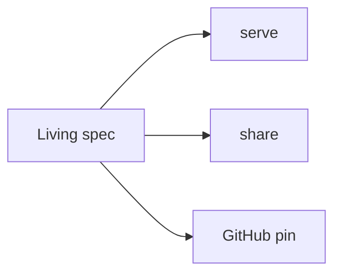
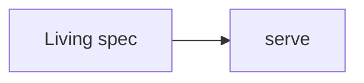

# diffmap

A viewer for specs and walkthroughs. Call stacks, mermaid that links into source, and a Diff panel. This page is one — `parseViewerDocument` plus `ViewerApp`, same path as `diffmap serve`.

TOC on the left, article here, Diff on the right. Click a stack row or a mermaid node.

## Install the skill

```sh
npx skills add tanishqkancharla/diffmap --skill generate-spec
```

That keeps a living spec in `specs/<name>.md`. Same file for the life of the work: what’s already in the tree, and what’s still planned. Don’t start a second walkthrough later.

## Serve locally

```sh
npx @tanishqkancharla/diffmap serve specs/<name>.md
```

Bare `npx @tanishqkancharla/diffmap specs/<name>.md` is the same as `serve`. `list` shows running viewers — reuse the URL instead of starting a second server.

**Close server** is only on that local page. This host has no process to stop.

## Share

### Gist

```sh
npx @tanishqkancharla/diffmap share specs/<name>.md
```

Prints `https://diffmap.dev/g/<gistId>` (optional `/<file.md>`). Secret gist: unlisted, not private. Anyone with the id can read it. Does not start a local server.

### GitHub PR vs commit

A spec on a public PR:

`https://diffmap.dev/<owner>/<repo>/pull/<n>/specs/<name>.md`

Pinned commit:

`https://diffmap.dev/<owner>/<repo>/commit/<sha>/specs/<name>.md`

The pin is one SHA. The markdown and every `[[path]]`, mermaid `%% ref`, excerpt, and hunk load from that commit, not `main`. A PR number only chooses the SHA (head at load, then pin). Refresh stays on the commit URL.

## What the fences are

### System flow

Click a node. `%% ref` is a mermaid comment; `[[path]]` and `[[path#symbol]]` are the same references as on a stack row.



````md

````

### Call stacks

`-` is current, `+` is proposed. After a phase lands, retarget `[[path]]` to a hunk: `[[id:old:…]]` / `[[id:new:…]]`.

```callstack
 ViewerApp
-└── CloseServerButton  # every hosted page tried to stop a server [[close:old:217]]
+└── CloseServerButton  # local mode only [[close:new:217-224]]
     └── DiffButton
```

```callstack
 shareMarkdownFile [[src/share.ts#shareMarkdownFile]]
-└── print gist URL [[share:old:62]]
+└── gistViewerUrl  # https://diffmap.dev/g/<id> [[share:new:62]]
```

### Source patches

Define each id once. Copy the real `git diff` (`diff --git`, `---`, `+++`, `@@`). Ranges have to sit inside an included hunk.

```source-diff:cli:src/cli.ts
diff --git a/src/cli.ts b/src/cli.ts
--- a/src/cli.ts
+++ b/src/cli.ts
@@ -49,4 +49,4 @@
 const cli = Cli.create("diffmap", {
-  description: "Serve a walkthrough",
+  description: "Serve a spec locally, or share it as a gist",
   version: "0.1.3",
   args: serveArgs,
```

```source-diff:share:src/share.ts
diff --git a/src/share.ts b/src/share.ts
--- a/src/share.ts
+++ b/src/share.ts
@@ -59,6 +59,6 @@
   return {
     gistId,
     gistUrl,
-    viewerUrl: gistUrl,
+    viewerUrl: gistViewerUrl(gistId, undefined, process.env.DIFFMAP_ORIGIN),
   };
 }
```

```source-diff:close:src/viewer/ViewerApp.tsx
diff --git a/src/viewer/ViewerApp.tsx b/src/viewer/ViewerApp.tsx
--- a/src/viewer/ViewerApp.tsx
+++ b/src/viewer/ViewerApp.tsx
@@ -216,3 +216,10 @@
             {props.headerActions}
-            <CloseServerButton onClick={() => setShutDown(true)} />
+            {props.mode === "local" && (
+              <CloseServerButton
+                onClick={() => {
+                  setShutDown(true);
+                  void closeViewer();
+                }}
+              />
+            )}
           </div>
```

### File excerpts

`start:end:path`. Locally the server reads the workspace file. Here the bundled file is sliced the same way.

```58:72:src/cli.ts
const cli = Cli.create("diffmap", {
  description: "Serve a spec locally, or share it as a gist",
  version: packageVersion,
  args: serveArgs,
  options: serveOptions,
  output: serveOutput,
  hint: "`serve <spec.md>` runs the local viewer. `share <spec.md>` publishes a secret gist. `update` (or `--update`) installs the latest diffmap.",
  examples: [
    {
      args: { file: "spec.md" },
      description: "Same as `diffmap serve spec.md`",
    },
  ],
  run: runServe,
})
```

### HTML

Local `serve` trusts `html` in the file you pointed at. This host does not. Gist and GitHub pages are the same — no `dangerouslySetInnerHTML` from untrusted markdown.

```html
<aside>If this renders, the host leaked HTML.</aside>
```

## How a spec stays alive

Write `specs/<name>.md`. Serve it while you plan. When the plan changes, edit this file. When a phase lands, paste the patch and retarget the links so the Diff panel opens the change, not just the file.

### Phase 1: Spec and serve

```callstack
 generate-spec
 └── specs/name.md
     └── diffmap serve [[src/cli.ts]]
```

- [x] Install the skill.
- [x] Keep one living spec.
- [x] `diffmap serve` / `list`.

### Phase 2: Share it

```callstack
 specs/name.md
-└── localhost only
+├── diffmap share [[share:new:62]]
+└── GitHub PR URL [[src/github/route.ts]]
```

- [x] Gist URL for a snapshot.
- [x] PR URL when the spec lives in the repo (pin to one SHA).
